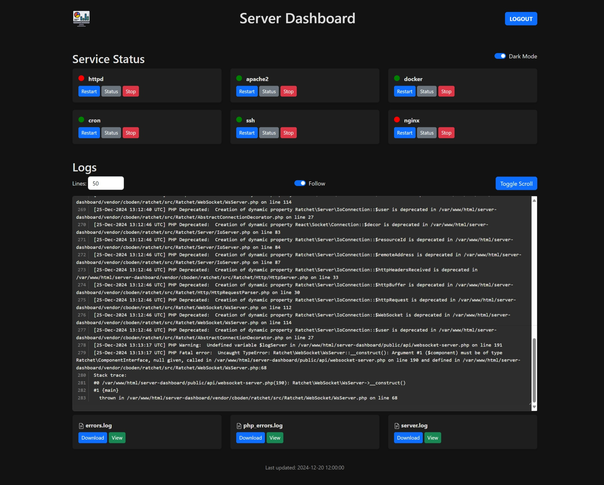

# Server Dashboard

Server Dashboard is a web application that allows users to manage server services and view log files. It provides functionalities to view status, restart and stop services, as well as view and download log files.



## Features

- **Service Management**:
  - View the status of services (e.g., nginx, mysql, apache2).
  - Add new services. (Upcoming)
  - Restart or stop services. (Upcoming)

- **Log Viewing**:
  - View log files from the server.
  - Download log files.
  - Stream log content in real-time.
  - Ability to add multiple log directories. (Upcoming)

- **WebSocket Integration**:
  - Real-time updates for service status and log streaming.

## API Endpoints

### Service Management

- `GET /api/services`: List all services and their statuses.
- `GET /api/services`: Restart or stop a specific service. (Upcoming)

### Log Management

- `GET /api/logs`: List available log files.
- `GET /api/logs/download?file=name`: Download a specific log file.
- `GET /api/logs/stream`: Stream log content in real-time.

## Installation

1. Clone the repository:
  ```sh
  git clone https://github.com/willi-esti/server-dashboard.git
  cd server-dashboard
  ```

3. Configure the environment variables in a [.env](.env.example) file.

4. Run the installation script with the desired options:
  ```sh
  sudo ./install.sh [--install] [--enable-ssl] [--enable-http] [--uninstall]
  ```

   - `--install`: Install the server dashboard.
   - `--enable-ssl`: Enable SSL and generate self-signed certificates.
   - `--enable-http`: Set up HTTP configuration.
   - `--uninstall`: Uninstall the server dashboard.

5. Enable and start the WebSocket server daemon:
  ```sh
  sudo systemctl enable websocket-server
  sudo systemctl start websocket-server
  ```

## Adding Sudo Rule (Upcoming)

To allow the `www-data` user to execute `systemctl restart` commands without a password, you can either add the rule manually or run the provided script.

### Using the Script (Upcoming)

1. Make the script executable:
   ```sh
   chmod +x add_sudo_rule.sh
   ```

2. Run the script:
   ```sh
   sudo ./add_sudo_rule.sh
   ```

### Manually (Upcoming)

1. Open the sudoers file for editing:
   ```sh
   sudo visudo
   ```

2. Add the following line to the file:
   ```
   www-data ALL=(ALL) NOPASSWD: /bin/systemctl restart *
   ```

3. Save and exit the editor.


## Usage

- **Add a Service**: Use the .env to add a new service. (like in the .env.example)
- **Manage Services**: Use the buttons next to each service to view the status, restart or stop the service.
- **View Logs**: Click on view log in the "Logs" section to view its content. Use the "Download" button to download the log file.

## Contributing

Contributions are welcome! Please open an issue or submit a pull request for any improvements or bug fixes.

## License

This project is licensed under the MIT License.
