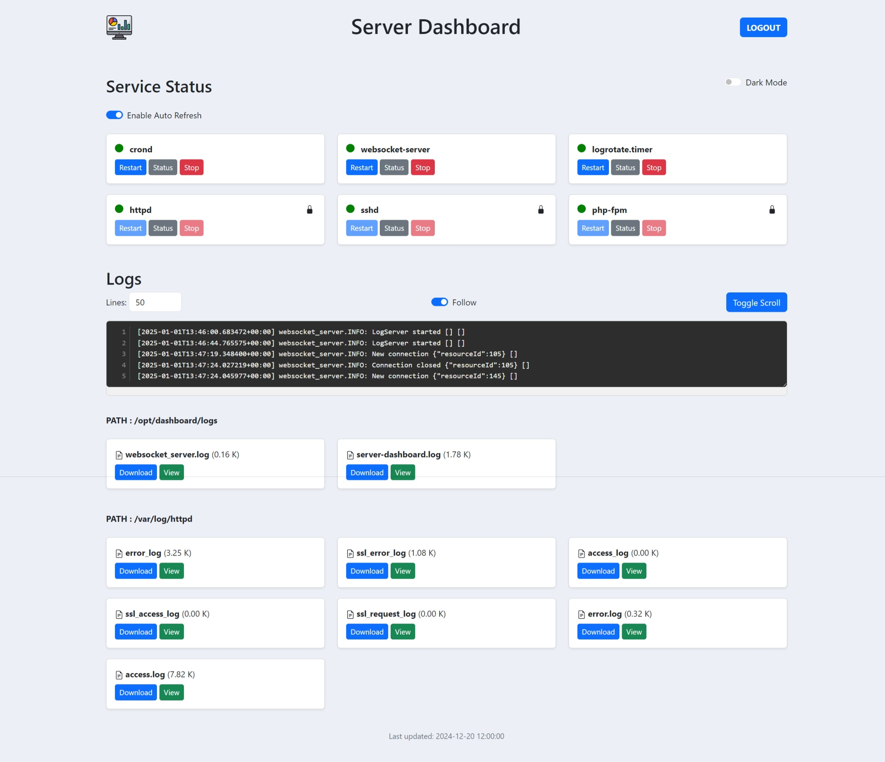

# Server Dashboard

Server Dashboard is a web application that allows users to manage server services and view log files. It provides functionalities to view status, restart and stop services, as well as view and download log files.



## Features

- **Service Management**:
  - View the status of services (e.g., nginx, mysql, apache2).
  - Add new services.
  - Restart, stop, or remove services.

- **Log Viewing**:
  - View log files from the server.
  - Download log files.
  - Stream log content in real-time.

- **WebSocket Integration**:
  - Real-time updates for service status and log streaming.

## API Endpoints

### Service Management

- `GET /api/services`: List all services and their statuses.
- `POST /api/services`: Add a new service to monitor.
- `PUT /api/services/:name`: Restart or stop a specific service.
- `DELETE /api/services/:name`: Remove a service.

### Log Management

- `GET /api/logs`: List available log files.
- `GET /api/logs/:name`: Download a specific log file.
- `GET /api/logs/:name/stream`: Stream log content in real-time.

## Installation Prerequisites

```sh
apt install php-sqlite3 sqlite3 composer
```
## Installation

1. Clone the repository:
  ```sh
  git clone https://github.com/willi-esti/server-dashboard.git
  cd server-dashboard
  ```

2. Install the required PHP libraries using Composer:
  ```sh
  composer install
  ```

3. Configure the environment variables in a [.env](.env.example) file.

4. Enable and start the WebSocket server daemon:
  ```sh
  sudo systemctl enable websocket-server
  sudo systemctl start websocket-server
  ```


## Usage

- **Add a Service**: Use the form in the "Service Status" section to add a new service.
- **Manage Services**: Use the buttons next to each service to restart, stop, or remove the service.
- **View Logs**: Click on a log file name in the "Logs" section to view its content. Use the "Download" button to download the log file.

## Contributing

Contributions are welcome! Please open an issue or submit a pull request for any improvements or bug fixes.

## License

This project is licensed under the MIT License.
