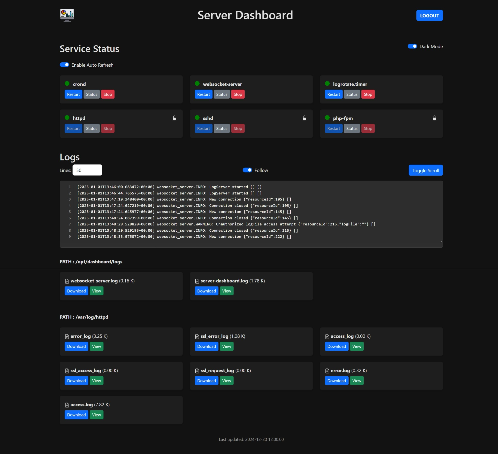

# Server Dashboard

Server Dashboard is a web application that allows users to manage server services and view log files. It provides functionalities to view status, restart and stop services, as well as view and download log files.



## Features

- **Service Management**:
  - View the status of services (e.g., nginx, mysql, apache2).
  - Add new services. (Upcoming)
  - Restart or stop services.

- **Log Viewing**:
  - View log files from the server.
  - Download log files.
  - Stream log content in real-time.
  - Ability to add multiple log directories. (Upcoming)

- **WebSocket Integration**:
  - Real-time updates for service status and log streaming.

## API Endpoints

### Service Management

- `GET /api/services`: List all services and their statuses.
- `POST /api/services`: Restart or stop a specific service.

### Log Management

- `GET /api/logs`: List available log files.
- `GET /api/logs/download?file=name`: Download a specific log file.
- `GET /api/logs/stream?token={token}&logFile={filename}`: Stream log content in real-time.

## Installation

1. Clone the repository:
  ```sh
  git clone https://github.com/willi-esti/server-dashboard.git
  cd server-dashboard
  ```

3. Configure the environment variables in a [.env](.env.example) file.
4. Run the installation script with the desired options:
  Recommended for full functionalities:
  ```sh
  chmod u+x install.sh # Make the script executable 
  sudo ./install.sh --install --enable-http --enable-ssl --add-sudo-rules # you should disable 000-default after the installation (a2dissite 000-default)
  ```

  Alternatively, you can use the following options:
  ```sh
  sudo ./install.sh [--install] [--enable-ssl] [--enable-http] [--uninstall] [--add-sudo-rules] [--remove-sudo-rules]
  ```

  - `--install`: Install the server dashboard. (The project will be in /var/www/html/server-dashboard)
  - `--enable-ssl`: Enable SSL and generate self-signed certificates. (The file server-dashboard-ssl.conf will be added to sites-available in the apache conf)
  - `--enable-http`: Set up HTTP configuration. (The file server-dashboard.conf will be added to sites-available in the apache conf)
  - `--uninstall`: Uninstall the server dashboard.
  - `--add-sudo-rules`: Adds sudo rules for specified services in the variable SERVICE of your .env. (File with all the rules: /etc/sudoers.d/www-data-restart)
  - `--remove-sudo-rules`: Removes sudo rules for specified services.

5. Enable and start the WebSocket server daemon:
  ```sh
  sudo systemctl enable websocket-server
  sudo systemctl start websocket-server
  ```

## Usage

- **Add a Service**: Use the .env to add a new service. (like in the .env.example)
- **Manage Services**: Use the buttons next to each service to view the status, restart or stop the service.
- **View Logs**: Click on view log in the "Logs" section to view its content. Use the "Download" button to download the log file.

## Contributing

Contributions are welcome! Please open an issue or submit a pull request for any improvements or bug fixes.

## License

This project is licensed under the MIT License.
